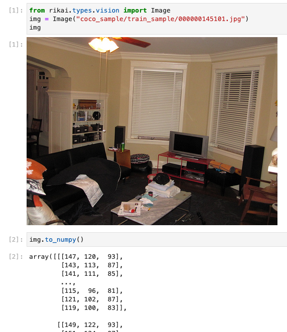

.. toctree::
   :maxdepth: 2

Domain-Specific Types
=====================

``Rikai`` provides a suite of domain-specific types that are interoperatable in
Spark, Pytorch and Tensorflow.

These domain-specific types implement the following traits.

* Spark's `User Define Types <https://spark.apache.org/docs/latest/api/java/org/apache/spark/sql/types/SQLUserDefinedType.html>`_,
  allows the types being serialized into Parquet.
* :py:class:`~rikai.mixin.ToNumpy` trait, makes these types automatically converted to
  appropriate Tensors in Pytorch or Tensorflow.
* Optionally, :py:class:`~rikai.mixin.Displayable` trait, offers native jupyter notebook integration.
* Optionally, :py:class:`~rikai.mixin.Asset` trait, indicates the data being stored externally,
  and can fetch the data on demand.

Typically, there are convenient spark UDFs (:py:mod:`rikai.spark.functions`) provided for these types if fit.

Computer Vision
---------------

:py:class:`~rikai.types.vision.Image` contains a reference to the external image.
It could be displayed natively in Jupyter notebooks, for example:

.. autoclass:: rikai.types.vision.Image
      :noindex:
      :members:

Video
-----

Geometry
--------

.. autoclass:: rikai.types.geometry.Box2d
      :noindex:

.. autoclass:: rikai.types.geometry.Box3d
      :noindex:

.. autoclass:: rikai.types.geometry.Point
      :noindex: